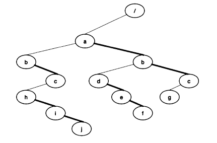

# File-system-tree
user cmd
```
1. mkdir: usage: mkdir <pathname>, create directory on given pathname
2. rmdir: usage: rmdir <pathname>, remove directory from its path
3. cd: usage: cd <pathname>, change CWD to given pathname
4. ls: usage: ls <pathname> or ls, list dir. content of pathname
5. pwd: usage: pwd, print absolute pathname of CWD
6. creat: usage: creat <pathname>, create FILE on given pathname
7. rm: same usage as rmdir but it remove, file
8. save: usage: save <filename>, save the current file system tree as file
9. reload: usage: reload <filename>, construct a file system tree from a file
10.menu: usage: menu, it shows the available commands.
11.quit: usage: quit, terminate program.
```
Binary Search Tree will be used as general tree

